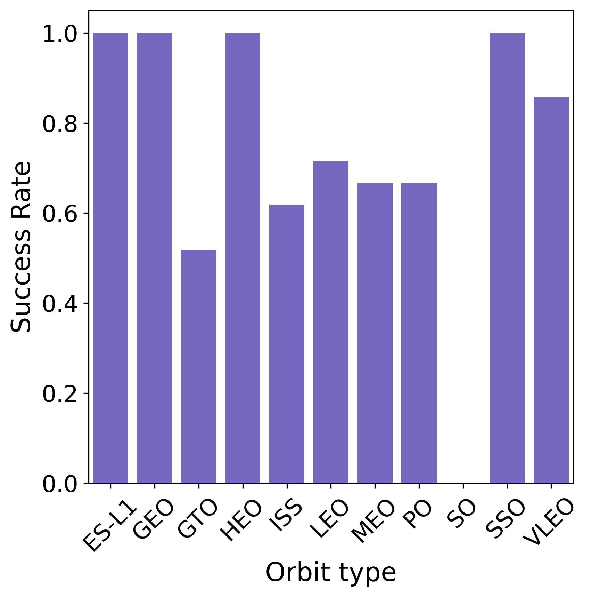

# SpaceX Data Science Project

## Table of Contents
* [Introduction](#introduction)
* [Methods](#methods)
* [Results and Discussion](#results-and-discussion)
* [Conclusions](#conclusions)

## Introduction
[SpaceX](https://www.spacex.com) is a privately owned aerospace manufacturer and space transportation company. In 2015 the company achieved it's first successful recovery of the first stage of the rocket when the [Falcon 9 flight 20](https://en.wikipedia.org/wiki/Falcon_9_flight_20) made a vertical landing after launch. This flight was part of a larger effort to develop a reusable launch system, which dramatically reduces cost and waste. Since this successful landing, there have been numerous other attempts, both successful and un-successful. The probability of a successful landing is likely due to a multitude of launch and rocket variables. Therefore, the objective of this project was to develop a model that can predict whether a launch will have a successful first stage landing.  

## Methods
### Data acquisition
Data were collected by calling the SpaceX API and scraping the [SpaceX Wikipedia page](https://en.wikipedia.org/wiki/SpaceX). Data were filtered to contain only hose relating to Falcon 9 launches and specific variables collected are listed below.

#### SpaceX API
* Flight Number - The number of the flight, with 1 indicating the first Falcon 9 flight
* Date - The date of the flight
* Booster Version - They type of booster uses in the launch
* Payload Mass- The mass of the payload in kg
* Orbit - The type of orbit the payload was going into (ex. Near Earth Orbit)
* Launch Site - The ID of the site the rocker was launched from
* Outcome - The outcome (success/failure) and the method of landing (ex. drone ship)
* Flights - The number of previous flights
* Grid Fins - Whether grid fins were present on the rocket
* Reused - Indicates if the rocket was used prior to this launch
* Legs - Indicates if the ship has landing legs
* Landing pad - Indicates the type of landing pad used by the first stage
* Block - The core block number
* Reused Count - The number of times the rocket has been reused
* Serial - The capsule serial
* Longitude - The longitude of the launch site
* Latitude - The latitude of the launch site

#### Scraping Wikipedia
* Flight Number - The number of the flight, with 1 being the first Falcon 9 launch
* Launch Site - The launch site of the rocket
* Payload - The payload the rocket was launching
* Payload mass - The mass of the payload in kg
* Orbit - They type of orbit that was intended (ex. Low Earth Orbit)
* Customer - The customer that SpaceX was launching the rocket for (ex. NASA)
* Launch outcome - The outcome of the launch (success/failure)
* Version - The version of the booster (F9)
* Booster - The version of the F9 booster used
* Booster landing - Indicates the success, failure, or lack of attempt at re-landing the booster
* Date - The date of lauch
* Time - The time of launch

### Data Cleaning
Data were checked for the presence of missing values. There were 5 instances in which `PayloadMass` was missing. This was dealt with by imputing the mean `PayloadMass` for these cases.

As described above, the landing outcome feature indicates both the success or failure of the landing as well as the type of landing. Therefore, a new feature, `Outcome` was created to indicate the success (1) or failure (0) of the landing. This was later used as the prediction target. 

### Feature Selection

The following features were selected for predictive modeling based on relevance and correlation with the outcome: `FlightNumber`, `PayloadMass`, `Flights`, `Block`, `ReusedCount`, `Orbit`, `Serial`, `GridFins`, and `Legs`. The variables `Orbit`, `Serial`, `GridFins`, and `Legs` were categorical variables, so they were one-hot encoded and merges with the rest of the feature set.

### Model Derivation

#### Training and Testing Data
Prior to any pre-processing, the data set, which had 90 observations, was split into training and testing data with a test size of 20%. 

#### Preprocessing
All features were standardized by dividing the difference from the mean by the standard deviation using the `StandardScaler()` method. The equation for this is shown below.

$\huge z = \frac{x - \mu}{\sigma}$ **Standardization Equation**

Where x is the observed value, $\mu$ is the mean of that feature, and $\sigma$ is the standard deviation of that feature.

#### Hyperparameter selection
Data were fit using logistic regression (Table 1), support vector classification (Table 2), decision tree classification (Table 3), and k-Nearest Neighbors (Table 4). Hyperparameters were selected using a grid search to find the combination of parameters that maximized the accuracy. Tested parameters are shown in the tables below. 

**Table 1:** Hyperparameters tested for logistic regression. The best combination of parameters is bolded.

|    C     | Pentlty | Solver |
| -------- | ------- | ------ |
| **0.01** | **L2**  | **LBFGS**|
| 0.1      |         |        |
| 1        |         |        | 


**Table 2:** Hyperparameters tested for support vector classification. The best combination of parameters is bolded.

| Kernel     | C                            | Gamma                        |
| ------     | :--------------------------: | :--------------------------: |
| Linear     | 1.0 $\times$ 10<sup>-3</sup> | 1.0 $\times$ 10<sup>-3</sup> |
| RBF        |3.16 $\times$ 10<sup>-2</sup>|**3.16 $\times$ 10<sup>-2</sup>**|
| Polynomial | **1**                        | 1                            |
| **Sigmoid**| 3.16 $\times$ 10<sup>1</sup> | 3.16 $\times$ 10<sup>1</sup> |
|            | 1.00 $\times$ 10<sup>3</sup> | 1.00 $\times$ 10<sup>3</sup> |


**Table 3:** Hyperparameters tested in the decision tree grid search. The best combination of parameters is bolded.

| Criterion | Splitter | Max Depth | Max Features | Min # of Samples/leaf | Min Sample Split |
| :-------: | :------: | :-------: | :----------: | :-------------------: | :--------------: |
| Gini      | Best     | 2         | **Auto**     | 1                     | 2                |
|**Entropy**|**Random**| 4         | SQRT         | **2**                 | 5                |
|           |          | **6**     |              | 4                     | **10**           |
|           |          | 8         |              |                       |                  |
|           |          | 10        |              |                       |                  |
|           |          | 12        |              |                       |                  |
|           |          | 14        |              |                       |                  |
|           |          | 16        |              |                       |                  |
|           |          | 18        |              |                       |                  |


**Table 4:** Hyperparameters tested in the k-Nearest Neighbors grid search. The best combination of parameters is bolded.

| n Neighbors | Algorithm | p   |
| ----------- | --------- | --- |
| 1           | **Auto**  | **1**|
| 2           | Ball Tree | 2   |
| 3           | KD Tree   |     |
| 4           | Brute     |     |
| 5           |           |     |
| 6           |           |     |
| 7           |           |     |
| 8           |           |     |
| 9           |           |     |
| **10**      |           |     |

## Results and Discussion

### Exploratory Data Analysis
In general, as the flight number increased so did the chance for a successful landing (Figure 1). This is unsurprising as the cause of each failed attempt can be corrected in a subsequent launch. 

**Figure 1:** Payload mass vs. flight number. The Booster landing success or failure is indicated by the class, with 0 indicating failure and 1 indicating success.


It was noted that the ratio of successes to failures was dependant on the launch site (Figure 2). The launch site CCAFS SLC 40 had the greatest number of failures. However, it should be noted that this site contained nearly all of the early launches (flight number < 20). Site KSC LC 39A did not launch a rocket until after 20 previous flights.

**Figure 2:** Launch site vs. flight number. The Booster landing success or failure is indicated by the class, with 0 indicating failure and 1 indicating success.


The payload mass was dependent on the site the rocket was launched from (Figure 3). Site VAFB SLC-4E contained no rockets greater than 10,000 kg and only a single rocket greater than 5,000 kg. 

**Figure 3:** Launch site vs. payload mass. The Booster landing success or failure is indicated by the class, with 0 indicating failure and 1 indicating success.


Rockets intended for ES-L1, geosynchronous, highly elliptical, and sun-synchronous orbits all had a 100% success rate for rocket landing (Figure 4). Other types of launches had varying rates of success, but the success rate was generally greater than 50%. 

**Figure 4:** Booster landing success rate vs. orbit type.



As would be expected, the success rate increased with time (Figure 5). This is likely due to a combination of factors including increased flight number, technical developments in the booster, improved engineering, and advances in research.

**Figure 5:** Booster landing success rate vs year for rockets launched by SpaceX.


### Model Performance
The performance of models for the test set is shown in Table 5. All models performed equally well against the test data, but k-Nearest Neighbors provided the greatest accuracy score on the training data. Models were able to correctly classify all successful launches, but suffered from a large proportion of false positives. The recall score for the negative class was only 50%. It is possible that this is due to the greater proportion of sucesses to failures in the data set, and this may be improved by modifying the sampling technique (ex. stratified sampling). 

**Table 5:** Performance metrics of the various models used to predict the success or failure of a SpaceX booster landing.

| Model               | Precision-0 | Precision-1 | Recall-0 | Recall-1 | F1-0 | F1-1 |
| ------------------- | ----------- | ----------- | -------- | -------- | ---- | ---- |
| Logistic Regression | 1.00        | 0.80        | 0.50     | 1.00     | 0.67 | 0.89 |
| Decision Tree       | 1.00        | 0.80        | 0.50     | 1.00     | 0.67 | 0.89 |
| SVC                 | 1.00        | 0.80        | 0.50     | 1.00     | 0.67 | 0.89 |
| k-Nearest Neighbors | 1.00        | 0.80        | 0.50     | 1.00     | 0.67 | 0.89 |

## Conclusions
While accuracy tended to be good for the models (83%), all models suffered from a large degree of false positives. In fact, the models tested only correctly predicted half of the failed launches. Therefore, additional data should be collected before relying on these models to predict the result of a booster landing.


```python

```
